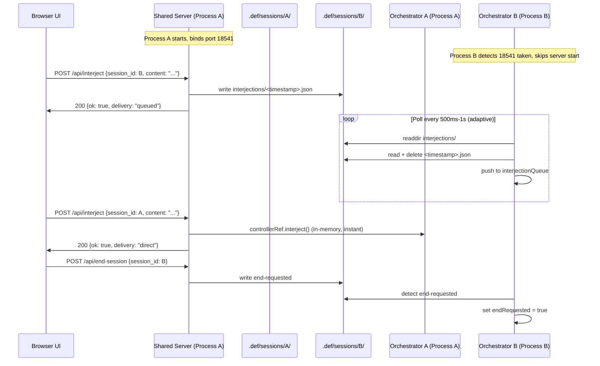

# feat: Shared Single-Server Architecture with File-Based IPC

## Overview

Convert DEF from a "one server per process" model to a "shared single server" model. The first `def` process starts the HTTP server on port 18541. Subsequent processes detect it and skip starting their own server. The UI can control ANY active session — interjections and end-session — via file-based inter-process communication. Each orchestrator polls its session directory for command files written by the shared server.

## Problem Frame

Currently, every `def` invocation starts its own HTTP server. When multiple sessions run concurrently, users get multiple browser tabs with fragmented control. The session explorer (PR #57-61) added multi-session *viewing* — the tab bar shows all sessions and their turns — but *controlling* non-owning sessions (interjections, end-session) is blocked because the Controller is an in-memory closure that can't cross process boundaries.

The user expects: one browser tab at `localhost:18541` that can view and control all running sessions. (see origin: docs/brainstorms/2026-03-25-session-explorer-requirements.md, success criteria)

## Requirements Trace

- R1. Single shared server — only one HTTP server runs on port 18541 across all `def` processes
- R2. Multi-session control — the UI can send interjections and end-session to any active session, not just the owning one
- R3. File-based IPC — command delivery uses the filesystem (no new dependencies), matching existing patterns
- R4. Graceful degradation — if the server-owning process exits, remaining processes continue headless; `def explorer` can restore UI access
- R5. Session-aware idle timeout — the server stays alive as long as any session has a live PID with fresh heartbeat
- R6. Explorer integration — `def explorer` and regular `def` sessions share the same server seamlessly
- R7. Zero new dependencies — the 5-dependency runtime limit is preserved

## Scope Boundaries

- Single-repo only — the shared server manages sessions within one repo (cross-repo shared server is deferred)
- No leader election — if the server-owning process exits, remaining processes run headless until `def explorer` is started
- No immediate cross-process kill — end-session sets a flag; the orchestrator detects it at poll intervals (up to 500ms-1s latency)
- No WebSocket/SSE push — polling remains the update mechanism
- No new CLI flags for server management — the shared server is automatic and transparent
- Shared-server mode requires port 18541 to be available. If another service occupies it, DEF falls back to isolated single-session mode with no cross-process control. Random-port fallback does not participate in shared-server discovery.

## Context & Research

### Relevant Code and Patterns

- `src/server.ts` — Module-level singletons (`sessionRef`, `controllerRef`). Three start modes: `start()`, `startReadOnly()`, `startExplorer()`. Routes: `GET /api/sessions`, `GET /api/sessions/:id/turns`, `POST /api/interject`, `POST /api/end-session`. Eviction logic in `evictStaleServer()`.
- `src/orchestrator.ts` — `Controller` closure created inside `run()` (lines ~186-207), captures `interjectionQueue[]`, `isPaused`, `humanResponseResolve`, `endRequested`, `session._currentChild`. Interjection drain at turn boundaries (line ~590). Heartbeat written to `heartbeat.json` every 10s.
- `src/index.ts` — Startup: create session -> register repo -> install shutdown handler -> import server -> `run(session, { server })` -> `beginIdleShutdown()`.
- `src/session.ts` — `listSessions()` with liveness detection (PID + heartbeat), `findSessionDir()`, atomic writes.
- `src/util.ts` — `atomicWrite()` (write .tmp, fsync, rename), `isProcessAlive()`.
- `src/ui/src/lib/api.ts` — `sendInterjection(content)` does NOT include `session_id`. `endSession()` has no session scoping.
- `src/ui/src/App.tsx` — `isReadOnly = sessionStatus !== "active"` (line 39). Controls shown for any active session.

### Institutional Learnings

No `docs/solutions/` directory exists. Key learnings from the codebase:
- All durable IPC is file-based with atomic writes. No file watchers exist — all observation is polling.
- Turn files are immutable once written; `session.json` is the only file with write-race potential.
- Windows atomic write can fail with EPERM if another process holds the file; readers should retry.

## Key Technical Decisions

- **File-based IPC over HTTP callbacks or named pipes**: The codebase already uses the filesystem for all inter-process state exchange (`session.json`, `heartbeat.json`, turn files). File-based command delivery adds no new patterns or dependencies. HTTP callbacks would require each process to run its own mini-server (defeating simplicity). Named pipes behave differently on Windows vs Unix.
- **Timestamp+random filenames for interjections**: Using `<session-dir>/interjections/<epoch-ms>-<randomHex(4)>.json` prevents data loss when multiple interjections arrive within one poll interval. `Date.now()` alone is insufficient because Windows timer resolution is ~15ms — two rapid interjections could collide. Appending 4 random hex bytes (`crypto.randomBytes(4).toString('hex')`) provides cross-process uniqueness while preserving chronological sort order via `readdir()`. The orchestrator consumes and deletes them in filename-sorted order.
- **Stateless server**: With file-based IPC, the server holds no controller references for non-owning sessions. It writes command files and reads session state from disk. This eliminates the need for registration protocols, server ownership transfer, and controller maps.
- **No server transfer on process exit**: If the server-owning process exits, remaining processes continue headless. Users can run `def explorer` to restore UI access. Leader election adds coordination complexity that isn't justified for a local CLI tool.
- **Controllability inferred from `is_active`**: The UI shows interjection/end-session controls for any session where `is_active === true` (live PID + fresh heartbeat). No explicit registration or `controllable_session_ids` field needed.
- **Owning session uses in-memory path**: When the server's own session receives an interjection or end-session, it routes through the existing in-memory `controllerRef` (zero latency). Only non-owning sessions use the file-based path. This preserves current behavior for the common single-session case. Server-side routing: if `session_id` matches `sessionRef?.id` or is omitted, use in-memory; otherwise use file-based. This keeps backward compatibility.
- **Lightweight session validation on POST**: The server validates target sessions via `findSessionDir()` + a single `session.json` read — not `listSessions()` which scans all session directories (O(N) reads). This keeps POST handler latency constant regardless of how many historical sessions exist.
- **Adaptive poll rate**: The orchestrator polls for interjection files at 1s normally, but drops to 500ms when the session is in `needs_human` (paused) state. The `needs_human` case is interaction-sensitive — users expect immediate response after being told "waiting for human." Normal interjections wait for turn boundaries anyway, so 1s is fine.

## Open Questions

### Resolved During Planning

- **IPC mechanism**: File-based signaling with numbered files per session directory. Matches existing patterns, no new dependencies. (Resolves deferred question from origin doc affecting R7)
- **Server transfer**: No transfer. Remaining processes continue headless. `def explorer` restores UI. (Resolves flow analysis Q2)
- **Controllability signal**: Inferred from `is_active` (PID + heartbeat), not a new API field. (Resolves flow analysis Q4)
- **Interjection concurrency**: Timestamp+random filenames (`<epoch-ms>-<randomHex(4)>.json`) prevent data loss even with Windows ~15ms timer resolution. No shared counter needed. (Resolves flow analysis Q5)
- **End-session latency**: Flag-only via `end-requested` file. The orchestrator checks at poll intervals (500ms when paused, 1s otherwise). Accept sub-second latency. Defer immediate cross-process child kill to future work. (Resolves flow analysis Q3)
- **Session validation cost**: Use `findSessionDir()` + single `session.json` read for POST validation, not `listSessions()`. Constant cost regardless of session count. (Resolves architecture review finding)
- **Active-only filter**: Keep the active-only filter in `handleGetSessions()` for normal mode. The shared server's tab bar should show active/paused sessions — not hundreds of historical ones. Explorer mode continues to show all. (Resolves conflict with PR #62 decision)

### Deferred to Implementation

- Whether `end-requested` should persist the requesting session's context (for logging) or just be a flag file
- Whether to add a lightweight server-side sweep that removes orphaned interjection files from completed/interrupted session directories (prevents directory clutter but not strictly necessary since sessions are single-use)

## High-Level Technical Design

> *This illustrates the intended approach and is directional guidance for review, not implementation specification. The implementing agent should treat it as context, not code to reproduce.*



```
Session directory additions:
<repo>/.def/sessions/<uuid>/
  interjections/              # NEW: file-based command queue
    <epoch-ms>-<hex4>.json     # {content: "user message"}
  end-requested               # NEW: flag file (existence = signal)
```

## Implementation Units

### Phase 1: File-Based IPC Infrastructure

- [ ] **Unit 1: Interjection file writer and reader**

**Goal:** Create the file-based interjection delivery mechanism — write side (server) and read side (orchestrator).

**Requirements:** R2, R3

**Dependencies:** None

**Files:**
- Create: `src/ipc.ts`
- Modify: `src/session.ts`
- Test: `src/__tests__/ipc.test.ts`

**Approach:**
- **Extract `isSessionAlive()` helper** from `listSessions()` in `session.ts` (lines 252-265). The liveness logic (PID alive check + heartbeat freshness against `HEARTBEAT_STALE_MS = 30s`) is self-contained and reused by Unit 3's POST routing and Unit 6's idle shutdown. Extract into:
  ```ts
  export async function isSessionAlive(sessionDir: string): Promise<{ alive: boolean; status: string }>
  ```
  Reads `session.json` for `session_status` and `pid`, reads `heartbeat.json`, applies the same PID + heartbeat freshness check. Returns `{ alive: true, status: 'active' }` or `{ alive: false, status: 'interrupted' }`. Refactor `listSessions()` to call this helper.

- **Add `exact` option to `findSessionDir()`**: Extend the signature to accept an optional `opts` parameter:
  ```ts
  export async function findSessionDir(targetRepo: string, id: string, opts?: { exact?: boolean }): Promise<string | null>
  ```
  When `exact: true`, match `dirs.filter(d => d === id)` instead of `d.startsWith(id)`. Unit 3's POST routing should call `findSessionDir(targetRepoRef, sessionId, { exact: true })` after UUID regex validation. This closes the prefix-matching security gap at the lookup function rather than relying on caller discipline.

- Create `src/ipc.ts` with:
  - `writeInterjection(sessionDir: string, content: string): Promise<void>` — creates `interjections/` dir if needed, writes `<Date.now()>-<randomHex(4)>.json` containing `{content}` via `atomicWrite()`. The random suffix prevents filename collision when `Date.now()` returns the same value (Windows ~15ms timer resolution).
  - `readInterjections(sessionDir: string): Promise<string[]>` — reads all files from `interjections/` sorted by filename, parses each, deletes consumed files, returns content array in delivery order. Must silently ignore `ENOENT` on both `readFile` and `unlink` (file may already be consumed by a previous poll's delayed deletion).
  - `writeEndRequest(sessionDir: string): Promise<void>` — writes empty `end-requested` file
  - `checkEndRequest(sessionDir: string): Promise<boolean>` — checks if `end-requested` exists, deletes it if found (ignoring `ENOENT`), returns true
- Use `atomicWrite()` for interjection files to prevent partial reads (a plain `writeFile` could result in the orchestrator reading half-written JSON)
- Use try/catch with retry-on-EPERM for Windows safety on reads and deletes
- `ENOENT` on `readFile`/`unlink` is silently ignored (not an error — the file was already consumed)

**Patterns to follow:**
- `atomicWrite()` from `src/util.ts` for writes
- `heartbeat.json` reading pattern in `src/session.ts` for retry-on-EPERM

**Test scenarios:**
- Write an interjection, read it back, verify file is deleted after read
- Write multiple interjections, read returns all in timestamp order
- Write end-requested, check returns true, subsequent check returns false
- Read from nonexistent interjections dir returns empty array
- Concurrent writes produce separate files (no data loss)

**Verification:**
- All IPC primitives work in isolation with proper cleanup

---

- [ ] **Unit 2: Orchestrator polls for file-based commands**

**Goal:** The orchestrator periodically checks its session directory for interjection and end-session command files, integrating them into the existing in-memory controller flow.

**Requirements:** R2, R3

**Dependencies:** Unit 1

**Files:**
- Modify: `src/orchestrator.ts`
- Test: `src/__tests__/ipc.test.ts` (extend)

**Approach:**

Two polling sites, each serving a different purpose:

1. **Background poll loop** (1s default, 500ms when paused): A recursive `setTimeout` inside `run()` that calls `readInterjections()` and pushes results to `interjectionQueue[]`, and calls `checkEndRequest()` and sets `endRequested = true` + kills child via `killChildProcess(session._currentChild)` from `src/util.ts` (not `child.kill()` — must use the utility for Windows process tree cleanup via `taskkill /T /F`). Use recursive `setTimeout` (not `setInterval`) because the delay must adapt dynamically: 500ms when `isPaused` is true (session in `needs_human` state), 1s otherwise. Each cycle schedules the next with the appropriate delay. Cancel the pending timeout in the `finally` block.

2. **`waitForHuman()` integration**: The current `waitForHuman()` creates a bare `Promise<string>` and stores its `resolve` in `humanResponseResolve`. The in-memory `controller.interject()` calls this resolve synchronously. For file-based IPC, the background poll interval (running at 500ms when paused) will pick up interjection files and should call `humanResponseResolve(content)` when it finds one while `isPaused` is true. This means the background poll needs to check both `isPaused` and `humanResponseResolve` — if both are set and an interjection file is found, resolve the promise directly instead of pushing to the queue. The existing in-memory controller path remains unchanged.

- The controller's `interject()` and `requestEnd()` methods remain unchanged for in-memory use by the owning server.

**Patterns to follow:**
- Heartbeat interval in `orchestrator.ts` (lines ~213-219): `setInterval` + `clearInterval` in `finally`
- Interjection drain logic (line ~590)
- `waitForHuman()` promise pattern (line ~687-691)

**Test scenarios:**
- Interjection file written to session dir is picked up and added to interjectionQueue
- End-requested file causes endRequested to be set and child to be killed
- Multiple interjection files are consumed in order
- Polling interval is cleared when orchestrator exits
- File-based interjection resolves a `waitForHuman()` pause (within 500ms)
- Poll interval adapts: 500ms when paused, 1s when active

**Verification:**
- Orchestrator responds to file-based commands within the poll interval

---

### Phase 2: Server Routing

- [ ] **Unit 3: Route interjections and end-session by session ID**

**Goal:** The server routes `POST /api/interject` and `POST /api/end-session` to the correct session — in-memory for the owning session, file-based for all others.

**Requirements:** R2, R3

**Dependencies:** Unit 1

**Files:**
- Modify: `src/server.ts`
- Test: `src/__tests__/server-multisession.test.ts` (extend)

**Approach:**
- **Routing logic**: `POST /api/interject` and `POST /api/end-session` both branch on `session_id`:
  - If `sessionRef` is null (explorer mode): `session_id` is required (return 400 if omitted), all routes go to file-based IPC
  - If `session_id` is omitted or matches `sessionRef?.id`: use `controllerRef.interject()` / `controllerRef.requestEnd()` (existing in-memory path, zero latency)
  - Otherwise: resolve session directory via `findSessionDir()`, read that session's `session.json` to verify `session_status === 'active'`, then call `writeInterjection()` / `writeEndRequest()` (file-based path)
- **Remove existing 403 guard**: The current `handleInterject` returns 403 when `session_id` doesn't match `sessionRef.id` (defense-in-depth for single-session mode). This guard must be removed — the new routing logic replaces it.
- **Remove controllerRef null guards**: The current `handleRequest` returns 404 when `controllerRef` is null (lines ~390-401). These upstream guards must be moved into the in-memory branch of the routing logic, since the file-based path does not require a non-null `controllerRef`. **Note:** This is a deliberate behavioral change for explorer mode — `startExplorer()` previously set `readOnlyMode = true` and blocked all POSTs. With the shared server model, explorer mode is no longer read-only for POST endpoints. When `sessionRef` is null, POST routes require `session_id` and use file-based IPC. Update the `startExplorer()` JSDoc accordingly.
- **Add body parsing to handleEndSession**: The current `handleEndSession` does not call `readBody()` or parse JSON. Add body parsing to extract `session_id`, following the same pattern as `handleInterject`.
- **Content validation on file-based path**: Before calling `writeInterjection()`, apply the same content validation as `handleInterject`: verify content is a non-empty string, enforce `MAX_CONTENT_LENGTH` (10K chars), trim whitespace.
- **Session ID validation**: For POST routes, validate `session_id` is a full UUID via regex, then call `findSessionDir(targetRepoRef, sessionId, { exact: true })` using the `exact` option added in Unit 1. This closes the prefix-matching security gap at the lookup function level.
- **Response differentiation**: Return `{ok: true, delivery: "direct"}` for in-memory and `{ok: true, delivery: "queued"}` for file-based, so the UI knows latency characteristics
- **Validation**: Use `isSessionAlive()` extracted in Unit 1 to check target session liveness. This is O(1) per session (constant regardless of total session count) vs `listSessions()` O(N). Return 404 for unknown sessions, 409 for completed/interrupted sessions, 410 if `session_status` is `active` but PID is dead or heartbeat is stale.
- **Empty-body backward compatibility**: Preserve the lenient Content-Type check for `end-session` (allow empty POST with no Content-Type or empty body). The current `handleEndSession` (`server.ts:721-731`) does not call `readBody()` and uses a lenient `if (contentType && !contentType.includes(...))` check -- allowing requests with no Content-Type at all. The frontend's `endSession()` in `api.ts:33-38` sends `Content-Type: application/json` but no body. Pattern for `end-session`:
  ```ts
  let sessionId: string | undefined;
  if (body) {
    try { sessionId = JSON.parse(body).session_id; } catch { /* treat as undefined */ }
  }
  ```
  Do NOT apply this leniency to `handleInterject` -- keep the strict 400 for malformed interjection JSON. The asymmetry is intentional: interjections carry content that must parse; end-session is a flag that only optionally carries a target.
- **Add `server: "def"` to `/api/sessions` response**: Include a `server: "def"` field in the `GET /api/sessions` response body so the shared-server probe in Unit 5 can verify it is talking to a DEF server (not an unrelated service on 18541). This is a response schema change that must ship before Unit 5 consumes it.

**Patterns to follow:**
- Existing `handleInterject()` in `server.ts` for validation, CSRF checks, content length limits
- `findSessionDir()` in `session.ts` for session lookup

**Test scenarios:**
- Interjection to owning session uses in-memory controller (direct delivery)
- Interjection to non-owning active session writes to file (queued delivery)
- Interjection to completed session returns 409
- Interjection to nonexistent session returns 404
- End-session to owning session calls requestEnd()
- End-session to non-owning session writes end-requested file
- Omitted session_id routes to owning session via in-memory path (backward compat)
- In explorer mode (no owning session), omitted session_id returns 400

**Verification:**
- All POST endpoints correctly route based on session ownership and session state

---

- [ ] **Unit 4: Update frontend to send session_id with all commands**

**Goal:** The UI sends `session_id` with every interjection and end-session request, and shows controls for any active session.

**Requirements:** R2

**Dependencies:** Unit 3

**Files:**
- Modify: `src/ui/src/lib/api.ts`
- Modify: `src/ui/src/lib/types.ts`
- Modify: `src/ui/src/App.tsx`

**Approach:**
- `sendInterjection(sessionId, content)` — add `session_id` parameter, include in POST body
- `endSession(sessionId)` — add `session_id` parameter, include in POST body. Note: `endSession()` currently sends an empty POST with no body — must add JSON body serialization.
- `App.tsx`: pass `selectedSessionId` to `sendInterjection()` and `endSession()` calls. Update `handleEndSession` callback from `endSession()` to `endSession(selectedSessionId)`.
- `isReadOnly` remains `sessionStatus !== "active"` — this already allows controls for any active session regardless of ownership
- Remove `owningSessionId` from the `isOwningSession` check (it's already not used for `isReadOnly` after PR #62, but clean up any remaining references)
- `InterjectionInput` and `SessionHeader` already receive `isReadOnly` as a prop — no change needed to those components (not listed in Files)

**Patterns to follow:**
- Existing `sendInterjection()` in `api.ts`
- Existing prop drilling pattern in `App.tsx`

**Test scenarios:**
- Interjection input is visible for any active session (not just owning)
- End Session button is visible for any active session
- Interjection sends correct session_id for the selected session
- Switching sessions updates which session_id is sent

**Verification:**
- UI can send interjections and end-session to any active session shown in the tab bar

---

### Phase 3: Server Lifecycle

- [ ] **Unit 5: Skip server start when shared server exists**

**Goal:** When a `def` process detects an existing DEF server on port 18541, it skips starting its own server and runs headless. The existing server discovers the new session via filesystem polling.

**Requirements:** R1, R6

**Dependencies:** Units 2, 3

**Files:**
- Modify: `src/index.ts`
- Modify: `src/server.ts`

**Approach:**
- **Rename and refactor `evictStaleServer()` into `probeExistingServer()`** returning `{ action: 'join' | 'replace' | 'bind-new', port?: number }`. The probe checks port 18541 with `GET /api/sessions`:
  1. **Responds, has `server: "def"`, and at least one session with `is_active === true`** -- return `{ action: 'join' }`. The process skips server start and runs headless. Log: `"Shared server detected on port 18541 with active sessions, running headless"`.
  2. **Responds, has `server: "def"`, but all sessions are completed/interrupted/stale** -- return `{ action: 'replace' }`. The existing server is orphaned from a crashed process. Send `POST /api/end-session` to trigger its shutdown, wait briefly, then take ownership of port 18541. This is the existing eviction logic, retained for the stale-server case.
  3. **Does not respond, times out, or is not a DEF server (no `server: "def"` field)** -- return `{ action: 'bind-new' }`. Bind port 18541 normally.
- **Fixed-port discovery only**: The probe only checks port 18541. A process on a random port does not participate in shared-server discovery. If a non-DEF service occupies 18541 (case 3 without a response), the process falls back to a random port and operates in isolated single-session mode -- no shared-server features.
- **`index.ts` ownership flag**: Track whether this process owns the server via an explicit `ownsServer` boolean:
  ```ts
  let ownsServer = false;
  if (server) {
    const probe = await probeExistingServer(18541);
    if (probe.action === 'join') {
      // Headless -- shared server already running
    } else {
      // 'replace' or 'bind-new' -- this process starts the server
      await server.start(session, controller);
      ownsServer = true;
    }
  }
  ```
  In the `finally` block: only call `server.beginIdleShutdown()` if `ownsServer` is true. Otherwise, just exit. This prevents the headless process from attempting idle shutdown on a server it never started (the current code at `index.ts:128` guards only on import success, which is insufficient).
- The process still writes its session to disk, writes heartbeat, and runs the orchestrator normally. The shared server discovers it via `listSessions()` on the next poll cycle (within 5s).
- Write the shared server's port (18541) to the new session's `session.json` for diagnostic purposes.
- `installShutdownHandler()` continues to work (SIGINT kills child, commits changes, cleans worktree).

**Patterns to follow:**
- Existing `evictStaleServer()` HTTP probe logic (`server.ts:65-111`) -- reuses the same `GET /api/sessions` probe pattern, extended with `server: "def"` field check and liveness evaluation
- Existing headless mode fallback in `index.ts` (when server import fails)

**Test scenarios:**
- With a server already running on 18541, new `def` process runs headless
- Headless process's session appears in the shared server's session list within 5s
- Headless process's interjections are routed via file-based IPC
- Headless process exits cleanly without affecting the shared server

**Verification:**
- Two concurrent `def` processes share a single browser tab and both sessions are controllable

---

- [ ] **Unit 6: Session-aware idle timeout**

**Goal:** The server's idle timeout considers active sessions, not just HTTP activity. It only begins shutdown when no active sessions remain.

**Requirements:** R5

**Dependencies:** Unit 5

**Files:**
- Modify: `src/server.ts`

**Approach:**
- Replace the current idle timer (resets on any HTTP request) with a dual check: idle timer resets on HTTP requests AND the timer callback checks `listSessions()` for any active sessions before shutting down. If active sessions exist, restart the timer.
- `beginIdleShutdown()` behavior changes: it now means "start checking for shutdown conditions" rather than "shut down after idle timeout."
- The server also starts the idle check when the owning session completes (existing trigger point in `index.ts`).
- **Session-aware idle for all server owners, including explorer mode**: The idle shutdown distinction is **server owner vs headless process**, not **owning session vs explorer mode**. Any process acting as server owner -- whether it started via `def <topic>` or `def explorer` -- must check `listSessions()` for active sessions before shutting down. The idle timer fires as before (HTTP activity reset + timeout callback), but the callback calls `listSessions()` and restarts the timer if any session has `is_active === true`. Only headless processes (which have no server) skip idle shutdown entirely.
- **Performance note**: If `listSessions()` becomes a bottleneck (hundreds of session directories), consider a lighter check: scan only for directories with a `heartbeat.json` modified within `HEARTBEAT_STALE_MS`. Defer to implementation judgment.

**Patterns to follow:**
- Existing `resetIdleTimer()` and `beginIdleShutdown()` in `server.ts`
- `listSessions()` and `isSessionAlive()` (from Unit 1) for liveness detection

**Test scenarios:**
- Server stays alive when owning session completes but another active session exists
- Server shuts down after all sessions complete and idle timeout expires
- HTTP activity resets the idle timer as before
- Explorer-mode server owner stays alive when headless sessions are active
- Explorer-mode server owner shuts down when all sessions complete

**Verification:**
- The shared server remains available for the full duration of all active sessions

---

### Phase 4: Cleanup and Integration

- [ ] **Unit 7: Adapt server lifecycle, update explorer, and fix auto-selection**

**Goal:** Adapt `listenWithFallback()` to use the 3-way probe result from `probeExistingServer()` (Unit 5), update `def explorer` to coexist with the shared server model, and fix the UI auto-selection to prefer active sessions.

**Requirements:** R1, R6

**Dependencies:** Units 3, 5

**Files:**
- Modify: `src/server.ts`
- Modify: `src/explorer-cmd.ts`
- Modify: `src/ui/src/hooks/use-explorer.ts`

**Approach:**
- **Adapt `listenWithFallback()`** to use the 3-way probe result from `probeExistingServer()` (Unit 5). When the probe returns `'replace'`, evict and retry the preferred port. When it returns `'bind-new'`, bind normally. When it returns `'join'`, skip server start entirely. The random-port fallback remains for the case where port 18541 is occupied by a non-DEF service, but processes on random ports operate in isolated single-session mode (no shared-server features).
- `def explorer`: before starting its own server, probe port 18541 for an existing DEF server using `probeExistingServer()`. If a DEF server with active sessions exists (action = `'join'`), print the URL to stdout and open the browser to that URL, then exit (the existing server already has the explorer UI).
- Keep the active-only session filter in `handleGetSessions()` for normal mode -- the shared server's tab bar should show active/paused sessions, not hundreds of historical ones. Explorer mode continues to show all sessions.
- The `server: "def"` field in the `/api/sessions` response is added in Unit 3 (the producer). Unit 5 and Unit 7 are consumers of this field for probe verification.
- The `owning_session_id` field in the `/api/sessions` response remains (it tells the UI which session to auto-select and gets the home icon).
- Fix auto-selection in `use-explorer.ts`: when `owning_session_id` is null or refers to a completed session, prefer the most recently created *active* session (`sessions.find(s => s.is_active)`) before falling back to `sessions[0]`. This ensures that in the shared-server model, where the owning process may have finished, the UI auto-selects a running session over a completed one.

**Patterns to follow:**
- Existing `listenWithFallback()` structure
- Explorer's server detection in `explorer-cmd.ts`
- Auto-selection logic in `use-explorer.ts` (lines 93-100)

**Test scenarios:**
- Stale DEF server (all sessions completed) is replaced via validate-or-replace probe
- Non-DEF service on 18541 causes fallback to random port in isolated mode
- `def explorer` opens existing server's URL when one is already running
- Auto-selection prefers active session when owning session is completed

**Verification:**
- Multiple `def` processes and `def explorer` coexist on a single server with stale-server replacement

---

- [ ] **Unit 8: Update package.json and end-to-end verification**

**Goal:** Register new test files, verify the full pipeline works end-to-end.

**Requirements:** All

**Dependencies:** All previous units

**Files:**
- Modify: `package.json`

**Approach:**
- Add `src/__tests__/ipc.test.ts` to the `test` script in `package.json`
- Run full test suite, typecheck, and UI build to verify nothing is broken
- Manual smoke test: run two `def` sessions concurrently, verify single browser tab, verify interjections route to correct session

**Verification:**
- `npm test` passes (including new IPC tests)
- `npm run typecheck` passes
- `npm run build:ui` succeeds
- Manual: two concurrent sessions controllable from one browser tab

## System-Wide Impact

- **Interaction graph:** `POST /api/interject` and `POST /api/end-session` now have two code paths. The branching condition is `session_id === sessionRef?.id` (or omitted): in-memory `controllerRef` path (instant) vs file-based `writeInterjection()`/`writeEndRequest()` path (polled at 500ms-1s). The file-based path adds `src/ipc.ts` as a new dependency for both `server.ts` and `orchestrator.ts`.
- **Error propagation:** File write failures in `writeInterjection()` should return 500 to the UI. File read failures in the orchestrator should log and retry on next poll (non-fatal). `ENOENT` on `readFile`/`unlink` during consumption is silently ignored (already-consumed file). EPERM errors on Windows should be retried.
- **State lifecycle risks:** Interjection files must be consumed (deleted) after reading to prevent re-delivery. The `end-requested` file must be deleted after detection. Orphaned interjection files from crashed sessions are inert (sessions are single-use, different UUID). If the server writes an interjection to a session whose process exits between the liveness check and the file write, the file sits permanently — this is a non-issue functionally but could be cleaned up in a future sweep.
- **`owning_session_id` semantics:** In the shared server model, `owning_session_id` refers to the server-starting process's session. When that session completes, `owning_session_id` points to a completed session. The UI auto-selection fallback must prefer active sessions in this case, not blindly select the owning (completed) one.
- **API surface parity:** `sendInterjection()` and `endSession()` in `api.ts` gain a required `sessionId` parameter. The HTTP API continues to accept `session_id` as optional for backward compatibility (omitted = owning session, in-memory path). The server makes the routing decision — the client does not need to know which path is used.
- **End-session behavioral difference:** The in-memory path kills the agent child immediately (`killChildProcess`). The file-based path sets a flag that the orchestrator detects on next poll (up to 500ms-1s). The agent continues running briefly. The HTTP response should not imply the session ended immediately — `{ok: true, delivery: "queued"}` signals this.
- **Integration coverage:** The critical end-to-end scenario — two `def` processes sharing one server, UI sends interjection to the non-owning session, orchestrator picks it up — cannot be fully automated in unit tests. Manual testing or a dedicated integration test with two child processes is needed.

## Risks & Dependencies

- **Poll interval latency:** File-based IPC adds 500ms-1s latency for interjections to non-owning sessions. For `needs_human` pauses, the adaptive 500ms poll rate minimizes the perceived regression. For normal interjections (queued until turn boundary), the poll latency is invisible since the agent is already running. Mitigate further by keeping the in-memory path for the owning session.
- **Windows `Date.now()` timer resolution:** Windows has ~15ms timer resolution for `Date.now()`. Two rapid interjections could produce the same millisecond timestamp. Mitigated by appending `randomBytes(4).toString('hex')` to filenames — 4 billion possible suffixes per millisecond eliminates collision risk.
- **Windows file locking:** Atomic writes on Windows use `rename()`, which can fail with EPERM if another process holds the file. The `readInterjections()` function must retry on EPERM. `ENOENT` on `readFile`/`unlink` must be silently ignored (file already consumed). Existing `atomicWrite()` already handles this for writes.
- **Server-owning process crash:** If the process that owns the HTTP server crashes, all UI access is lost until `def explorer` is run. This is a known limitation, accepted per the "no leader election" decision. Remaining processes continue headless and complete normally.
- **Orphaned command files:** If a `def` process crashes after interjections were written but before it consumed them, the files remain on disk. These are inert (sessions are single-use, different UUID per session). A future cleanup sweep could remove interjection files from completed/interrupted session directories, but this is not required for correctness.
- **Unit 5 race condition:** Between probing port 18541 and the orchestrator starting, the server could shut down. The process would run headless unnecessarily. This is acceptable — headless mode is a supported path and the window is milliseconds.
- **Trust assumption:** All processes on the local machine are trusted to control any DEF session. File-based IPC trusts that only DEF processes write to session interjection directories. The server binds to 127.0.0.1 only. If multi-user scenarios arise, per-session tokens would be needed. This is acceptable because DEF is a single-user CLI tool.

## Sources & References

- **Origin document:** [docs/brainstorms/2026-03-25-session-explorer-requirements.md](docs/brainstorms/2026-03-25-session-explorer-requirements.md)
- **Session explorer plan:** [docs/plans/2026-03-25-002-feat-session-explorer-plan.md](docs/plans/2026-03-25-002-feat-session-explorer-plan.md) — the foundation this plan extends
- Related PRs: #57 (server API), #58 (frontend), #59 (explorer), #61 (empty state), #62 (UX fixes), #63-64 (port fixes)
